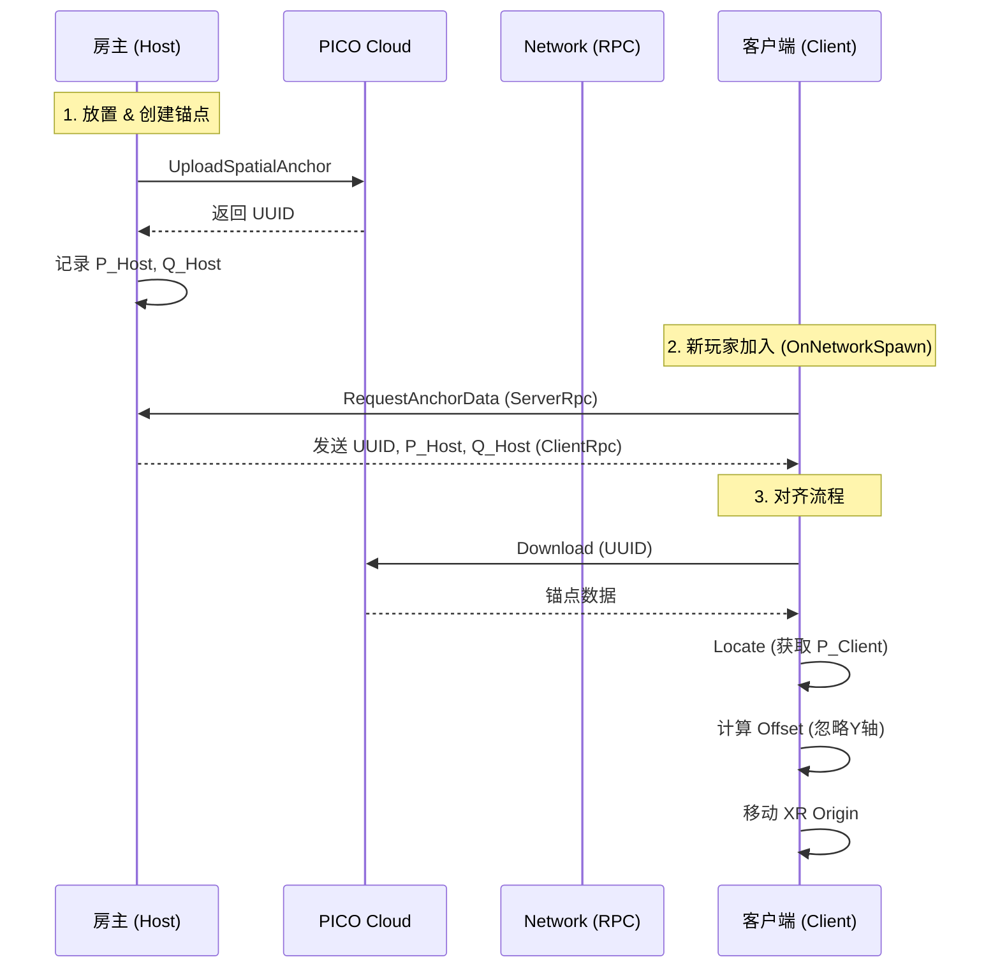

# Unity开发MR中应用空间锚点的场景

- 多人联机游戏需要对齐玩家元素（位置、物体位置等）
- 将物体持久化在某个现实对应的地方
- 没有大空间技术的普通消费级PICO头显设备MR玩家的同步

官方对于空间锚点的定义
::link{url="https://developer-cn.picoxr.com/document/unity/spatial-anchors/" title="空间锚点 | PICO 开发者平台" description="空间锚点技术可以将虚拟环境中的位置与真实世界中的位置进行锚定。放置空间锚点并将其持久化至设备磁盘中后，用户再次走到放置锚点的位置时，系统可以找回该锚点并返回给应用。" image="https://p9-arcosite.byteimg.com/tos-cn-i-goo7wpa0wc/2e96ba68be484bdc8e22457a6d5f2cf4~tplv-goo7wpa0wc-quality:q75.image"}

## 1.自身坐标的正确标定

在开始应用空间锚点之前，我们需要先将自身的坐标真实确定，比如身高1.7m，在你头显里面的坐标也应该贴近(x,1.7,x)
1. 房间标定，[查看官方](https://developer-cn.picoxr.com/document/unity/scene-capture/)
2. 地面标定，位于PICO头显的设置-安全防护-调整地面高度


## 2.核心难点：多人开发的坐标系的统一与区分
1. 每台PICO都有其独立的本地坐标系，而我们MR不同于VR的难点在于如何将两台及以上的坐标系统一起来；即虚拟坐标系（Coordinate System）统一到同一个物理参考系中
2. ***初期解决方法***：我们通过手动标定自己的原点（XZ）来完成虚拟与现实的统一，但是及其考研玩家的现实校准的地方的一致性，不方便；基本的核心原理都是将XROrigin置于一个根Root下进行变换

<details>
<summary>手动标定代码</summary>

```csharp
    /// <summary>
    /// 标定入口
    /// </summary>
    public void OnCalibrateOriginPressed()
    {
        if (userCamera == null)
        {
            SetLogInfo("错误：无法找到用户相机，无法进行标定！");
            return;
        }

        SetLogInfo("正在根据当前玩家位置标定共享原点...");

        // 1. 获取玩家头显在地板上的投影位置（Y=0）
        Vector3 headPositionOnFloor = new Vector3(userCamera.position.x, 0, userCamera.position.z);

        // 2. 获取玩家头显的水平朝向（忽略俯仰和侧倾）
        Quaternion headYawRotation = Quaternion.Euler(0, userCamera.eulerAngles.y, 0);

        // 3. [核心] 调用对齐方法，传入我们计算出的、理想化的玩家姿态
        //    这个方法会计算一个逆向变换，将这个姿态“拉回”到世界的(0,0,0)
        AlignSharedSpaceOrigin(headPositionOnFloor, headYawRotation);
    }
```

```csharp
    /// <summary>
    /// 坐标系的统一变换
    /// </summary>
    /// <param name="targetPosition">目标位置</param>
    /// <param name="targetRotation">目标旋转</param>
    private void AlignSharedSpaceOrigin(Vector3 targetPosition, Quaternion targetRotation)
    {
        if (xrSharedSpaceOrigin == null)
        {
            Debug.LogError("XR Shared Space Origin 未在Inspector中指定，无法对齐坐标系！");
            return;
        }

        // 计算将 targetPosition 和 targetRotation “拉回”到世界原点(0,0,0)所需的逆向变换
        Quaternion inverseRotation = Quaternion.Inverse(targetRotation);
        Vector3 inversePosition = inverseRotation * -targetPosition;

        // 将这个逆向变换应用到玩家的根节点上
        xrSharedSpaceOrigin.SetPositionAndRotation(inversePosition, inverseRotation);

        SetLogInfo("共享原点已成功标定！");
    }
```
</details>

以上的手动标定方案及其依赖双方对齐时的高度（因为这是是一个完全重设世界0点坐标系的过程），不精准，不稳定，只能作为开发过渡

## 3.空间锚点基本
对于空间锚点的基本应用（放置、持久化、销毁等）我的建议是多去研究上面那个官方基本文档，我这里碍于篇幅，只会提供不易发现，被垄断的部分，不过还是要注意以下几点核心
- 老老实实走PICO云端的方案，尽量不要尝试锚点数据走本地（因为其中的点云数据是加密的，解密成本高，不值）
- 锚点的主要传输依赖核心就是uuid，请在你的联机方案中重点聚焦于uuid的传输，放置、销毁、持久化均高度依赖uuid；
- 锚点的预制体一定要附带PXR_Spatial Anchor脚本
- 放置方面，更建议以手柄位置作为放置点，放置前的视觉预览体记得去掉（PXR_Spatial Anchor脚本）

## 4.共享空间锚点

### 1.流程
流程建议为联机-放置共享空间锚点-下载客户端-同步
<details>
<summary>流程图</summary>



</details>

### 2.详细解析

<details>
<summary>详细解析</summary>

1. **主机创建**：房主记录下该锚点在自己坐标系下的位置 $P_{Host}$ 和旋转 $Q_{Host}$。
2. **客机加入**：通过 ClientRPC 拿到 $P_{Host}$ 与 $Q_{Host}$，然后再下载共享的空间锚点（已上传到云）。
3. **加载锚点**：获取其在自己本地坐标系的位置 $P_{Client}$ 与旋转 $Q_{Client}$，然后经过数学矩阵变换后移动 XROrigin 的父物体 Root 节点即可。
4. **变换计算**：我们需要计算一个变换矩阵 $T_{Align}$。
    - $P_{Host}, Q_{Host}$：锚点在**房主**世界空间中的位置和旋转。
    - $P_{Client}, Q_{Client}$：锚点在**客户端**本地空间中的位置和旋转（未校准前）。
    - $Q_{Align}$：给客户端的旋转矫正。
    - $P_{Align}$：给客户端的位置矫正。

5. **旋转对齐**：对齐水平朝向（Yaw），**必须忽略 X/Z 轴的倾斜**，以保证重力方向永远垂直向下。

**1. 提取 Yaw 旋转**
对于任一旋转四元数 $Q$，其 Forward 向量在水平面上的投影为：
$\vec{F}_{projected} = \text{ProjectOnPlane}(Q \cdot \vec{Z}_{forward}, \vec{Y}_{up})$
提取后的 Yaw 旋转为：
$Q_{yaw} = \text{LookRotation}(\vec{F}_{projected}, \vec{Y}_{up})$
房主与客户端均这样处理，得到 $Q_{H\_Yaw}$ 和 $Q_{C\_Yaw}$。

**2. 计算旋转差值**
需要一个旋转 $Q_{Align}$，使得客户端旋转后等于房主的旋转：
$Q_{Align} \times Q_{C\_Yaw} = Q_{H\_Yaw}$
推导得出：
$Q_{Align} = Q_{H\_Yaw} \times Q_{C\_Yaw}^{-1}$

代码对应：
`Quaternion rotAlign = hostRot * Quaternion.Inverse(clientRot);`

6. **位置对齐**：客户端锚点被父物体变换后，位置应等于房主锚点的位置。
**公式推导：**
$P_{Host} = (Q_{Align} \times P_{Client}) + P_{Align}$
其中 $Q_{Align} \times P_{Client}$ 是将客户端的锚点位置进行旋转矫正。
需要求 $P_{Align}$，移项可得：
$P_{Align} = P_{Host} - (Q_{Align} \times P_{Client})$

代码对应：
`Vector3 posAlign = hostPos - rotAlign * clientPos;`

7. **地面模式修正**：虽然公式中得出了一定的 Y 轴数学解，但通常由地面标定误差引起，且我们采用 `TrackingOriginMode.Floor`，故丢弃 Y 轴偏移。
公式对应：
$P_{Align}.y = 0$

代码对应：`posAlign.y = 0f;`

8. **玩家数据模拟**

<details>
<summary>数学矩阵推演</summary>

- 房主锚点：$P_{host} = (2.0, 0.0, 3.0)$，朝向 Yaw = 30°
- 客户端锚点：$P_{client} = (3.0, 0.0, 2.0)$，朝向 Yaw = 10°
- **Yaw 旋转矩阵**：
  $R_y(\theta) = \begin{bmatrix} \cos\theta & 0 & \sin\theta \\ 0 & 1 & 0 \\ -\sin\theta & 0 & \cos\theta \end{bmatrix}$
  房主为：$R_{\text{host}} = R_y(30^\circ) = \begin{bmatrix} 0.8660254 & 0 & 0.5 \\ 0 & 1 & 0 \\ -0.5 & 0 & 0.8660254 \end{bmatrix}$
  客户端为：$R_{\text{client}} = R_y(10^\circ) = \begin{bmatrix} 0.98480775 & 0 & 0.17364818 \\ 0 & 1 & 0 \\ -0.17364818 & 0 & 0.98480775 \end{bmatrix}$
- **旋转对齐矩阵**：
  $R_{\text{align}} = R_{\text{host}} R_{\text{client}}^{-1} \approx \begin{bmatrix} 0.939693 & 0 & 0.34202 \\ 0 & 1 & 0 \\ -0.34202 & 0 & 0.939693 \end{bmatrix}$
  
  代码：`Quaternion rotAlign = hostRot * Quaternion.Inverse(clientRot);`

- **平移向量 $P_{Align}$**：
  $R_{align}P_{client} \approx \begin{bmatrix} 0.939693 & 0 & 0.34202 \\ 0 & 1 & 0 \\ -0.34202 & 0 & 0.939693 \end{bmatrix} \begin{bmatrix} 3 \\ 0 \\ 2 \end{bmatrix} \approx \begin{bmatrix} 3.503118 \\ 0 \\ 0.853325 \end{bmatrix}$
  $P_{align} = P_{host} - R_{align}P_{client} \approx \begin{bmatrix} 2 \\ 0 \\ 3 \end{bmatrix} - \begin{bmatrix} 3.503118 \\ 0 \\ 0.853325 \end{bmatrix} \approx \begin{bmatrix} -1.503118 \\ 0 \\ 2.146675 \end{bmatrix}$
- **4×4 齐次变换矩阵 $T_{align}$**：
  $T_{\text{align}} = \begin{bmatrix} R_{\text{align}} & \mathbf{p}_{align} \\ \mathbf{0}^\mathsf{T} & 1 \end{bmatrix} \approx \begin{bmatrix} 0.939693 & 0 & 0.34202 & -1.503118 \\ 0 & 1 & 0 & 0 \\ -0.34202 & 0 & 0.939693 & 2.146675 \\ 0 & 0 & 0 & 1 \end{bmatrix}$

</details>

**总结**：经过 $T_{align}$ 变换后，客户端观测到的锚点将完美对齐到房主的位置。

代码实现：
`xrSharedSpaceOrigin.SetPositionAndRotation(_currentAlignPos, _currentAlignRot);`
</details>

### 3.详细代码（需要适配你的网络架构等我是NGO）

<details>
<summary>具体代码</summary>

```csharp
    /// <summary>
    /// 执行空间对齐算法
    /// </summary>
    /// <param name="hostPos">房主发来的锚点世界坐标</param>
    /// <param name="hostRot">房主发来的锚点世界旋转</param>
    /// <param name="clientPos">客户端本地读取到的锚点坐标</param>
    /// <param name="clientRot">客户端本地读取到的锚点旋转</param>
    private void ApplyAlignment(Vector3 hostPos, Quaternion hostRot, Vector3 clientPos, Quaternion clientRot)
    {
        // 1. 提取 Yaw (保持重力垂直)
        if (yawOnly)
        {
            hostRot   = ExtractYaw(hostRot);
            clientRot = ExtractYaw(clientRot);
        }
        
        // 2. 计算旋转偏移
        Quaternion rotAlign = hostRot * Quaternion.Inverse(clientRot);

        // 3. 计算位置偏移 (Host - Rot * Client)
        Vector3 posAlign = hostPos - rotAlign * clientPos;

        // 既然双方都是 Floor 模式，XR Origin 的 Y 轴必须与物理地面重合，也就是必须为 0。
        // 任何 Y 轴的偏移都会导致玩家浮空或陷地。
        // 我们完全忽略锚点在高度上的测量误差，只信任 X, Z 和 旋转。
        posAlign.y = 0f;

        // 4. 平滑应用
        if (_hasCurrentAlign && alignLerp < 1f)
        {
            _currentAlignRot = Quaternion.Slerp(_currentAlignRot, rotAlign, alignLerp);
            _currentAlignPos = Vector3.Lerp(_currentAlignPos, posAlign, alignLerp);
        }
        else
        {
            _currentAlignRot = rotAlign;
            _currentAlignPos = posAlign;
            _hasCurrentAlign = true;
        }

        if (xrSharedSpaceOrigin != null)
        {
            xrSharedSpaceOrigin.SetPositionAndRotation(_currentAlignPos, _currentAlignRot);
        }
        
        // 调试日志
        float heightCorrection = hostPos.y - clientPos.y;
        // 如果这个值很大（比如 > 0.2），说明其中一人的地面标定严重错误，需要重置系统边界
        Debug.Log($"[Align] 已强制锁定地面。忽略的高度误差: {heightCorrection:F3}m");
    }
```
</details>

### 4.辅助检验代码

<details>
<summary>代码</summary>

```csharp
using UnityEngine;
using TMPro;
using Unity.XR.PXR;
using Unity.Netcode;

public class DebugInfoManager : MonoBehaviour
{
    [Header("UI 设置")]
    [Tooltip("拖入用于显示坐标信息的 TextMeshProUGUI")]
    public TextMeshProUGUI debugText;

    [Header("对象引用")]
    public Transform headCamera;       // 拖入 Main Camera
    public Transform xrOriginParent;   // 拖入 XR_SHARED_SPACE (XR Origin的父物体)

    private void Update()
    {
        if (debugText == null) return;
        if (headCamera == null) headCamera = Camera.main?.transform;

        System.Text.StringBuilder sb = new System.Text.StringBuilder();

        // 1. 身份信息
        string role = "未连接";
        if (NetworkManager.Singleton != null && NetworkManager.Singleton.IsListening)
        {
            role = NetworkManager.Singleton.IsServer ? "房主 (Host)" : "玩家 (Client)";
        }
        sb.AppendLine($"身份: <color=yellow>{role}</color>");

        // 2. 关键坐标 (World)
        // 如果这个 Y > 2.0，说明你被错误的对齐逻辑抬飞了
        Vector3 worldPos = headCamera != null ? headCamera.position : Vector3.zero;
        sb.AppendLine($"World Head: {FormatVec(worldPos)}");

        // 3. 本地坐标 (Local - 相对于 Origin)
        // 正常站立时，Y 应该在 1.6 ~ 1.8 之间 (Floor模式)
        Vector3 localPos = headCamera != null ? headCamera.localPosition : Vector3.zero;
        sb.AppendLine($"Local Head: {FormatVec(localPos)}");

        // 4. 原点偏移 (XR Origin)
        // Client 的 Y 必须是 0.00，如果不是，说明对齐逻辑错了
        if (xrOriginParent != null)
        {
            sb.AppendLine($"Origin Pos: {FormatVec(xrOriginParent.position)}");
            sb.AppendLine($"Origin Rot: {xrOriginParent.eulerAngles.y:F1}°");
        }

        // 5. 锚点误差监控 (从 Manager 获取)
        if (PXRSample_SpatialAnchorManager.Instance != null && PXRSample_SpatialAnchorManager.Instance.isCalibrated)
        {
            sb.AppendLine("<color=green>[已对齐]</color>");
        }
        else
        {
            sb.AppendLine("<color=red>[未对齐]</color>");
        }

        debugText.text = sb.ToString();
    }

    private string FormatVec(Vector3 v)
    {
        // X, Y, Z (保留2位小数)
        return $"({v.x:F2}, <color=#00FFFF>Y:{v.y:F2}</color>, {v.z:F2})";
    }
}
```
</details>

### 5.简单的完美同步
基本实现：现实=虚拟，虚实合一

<u>**请注意房主再放置锚点后要细细观察锚点周围的空间，尽量保持平稳角度，确保上传是缓慢进行的，一般一下子上传完成均不准；客户端在确认房主上传完毕后请仔细以房主视角观察**</u>

::link{url="https://space.micostar.tech" title="Spatial Alignment Visualizer" description="空间锚点对齐算法的交互式可视化演示工具，帮助理解坐标系变换原理。访问密码：pico"}


